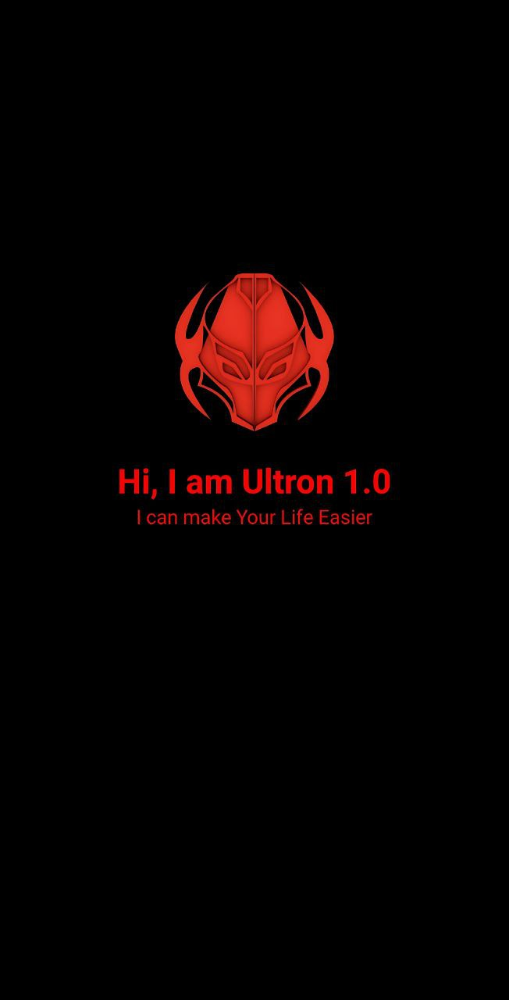
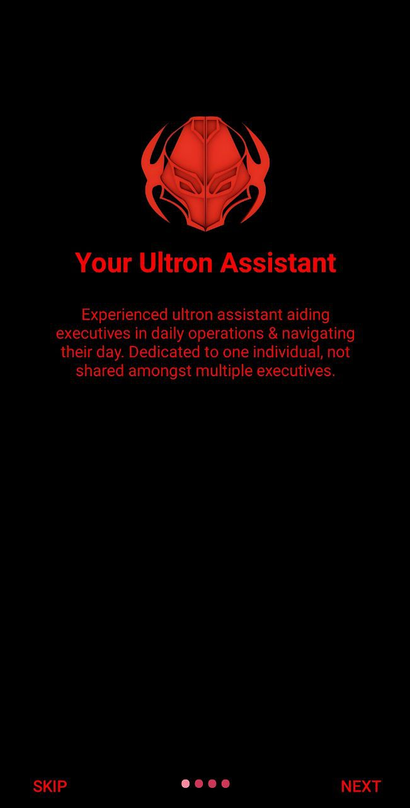
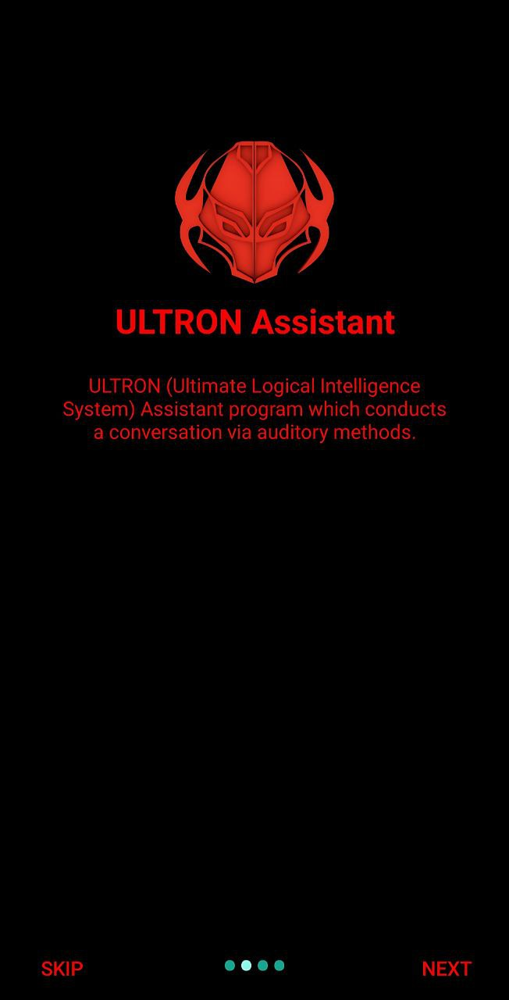
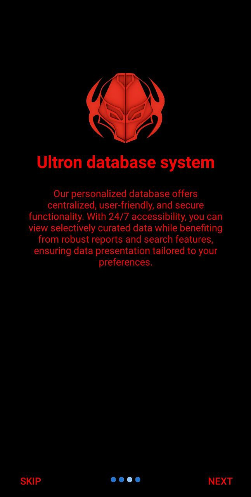
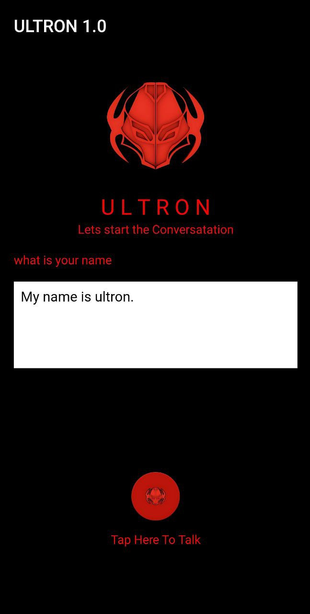

# Ultron-1.0 AI-Android-app

</img>

🤖 Introducing Ultron-1.0 AI, an advanced artificial intelligence designed to provide prompt, precise, and insightful responses to your inquiries in real-time. Whether you require assistance with daily tasks, seek knowledge, or simply wish to engage in conversation, Ultron-1.0 AI is here to meet your needs.

# Instructions 

1. Familiarize yourself with the user manual and understand the features, limitations, and potential risks associated with Ultron-1.0 AI Assistant.

2. Ensure that Ultron-1.0 AI Assistant is connected to a secure network, protected with a strong password, to prevent unauthorized access.

3. Regularly update Ultron-1.0 AI Assistant's software to benefit from security enhancements and bug fixes, ensuring optimal performance and minimizing vulnerabilities.

4. Protect your privacy by being cautious about sharing sensitive information such as passwords, financial data, or personal identification details.

5. Exercise caution when integrating Ultron-1.0 AI Assistant with third-party services or applications, verifying their security measures and compatibility.

6. Familiarize yourself with the emergency shut-down procedure in case of any unforeseen issues or safety concerns.

7. Provide appropriate supervision if Ultron-1.0 AI Assistant is used by children, the elderly, or individuals with limited capacity to prevent misuse or exposure to inappropriate content.

8. Promptly report any technical issues, security concerns, or unexpected behavior to the manufacturer or support team to ensure a safe user experience.

# Ultron-Ai App

  

<b>WARNING:</b> Users are advised that the application is intended for lawful and ethical purposes only. Any use of the app for illegal activities is strictly prohibited.

<table style="width:100%">
  <tr>
    <th>Example 1</th>
    <th>Example 2</th>
    <th>Example 3</th>
  </tr>
  <tr>
    <td></td>
    <td></td>
    <td></td>
  </tr>
  <tr>
    <th>Example 4</th>
    <th>Example 5</th>
    <th>Example 6</th>
  </tr>
  <tr>
    <td></td>
    <td></td>
    <td></td>
  </tr>
 
</table>
 

<h3 align="left">Support:</h3>

   

## Credits

- Graphics: [photoshop](https://www.adobe.com/products/photoshop.html) and [illustrator](https://www.adobe.com/products/illustrator.html)
- Develop Engine: [Android studio](https://developer.android.com/)
- Audio: [FL Studio](https://www.image-line.com/flstudio/) and [freesound.org](https://freesound.org/)
- Thanks to all of the friends for their awesome help.

Made with :heart: by [deepanjansitt](https://github.com/deepanjansitt)

